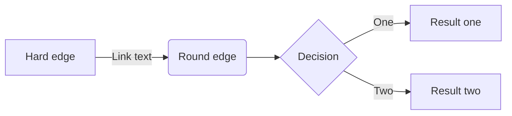
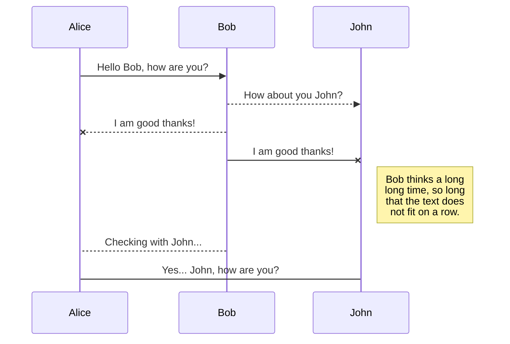
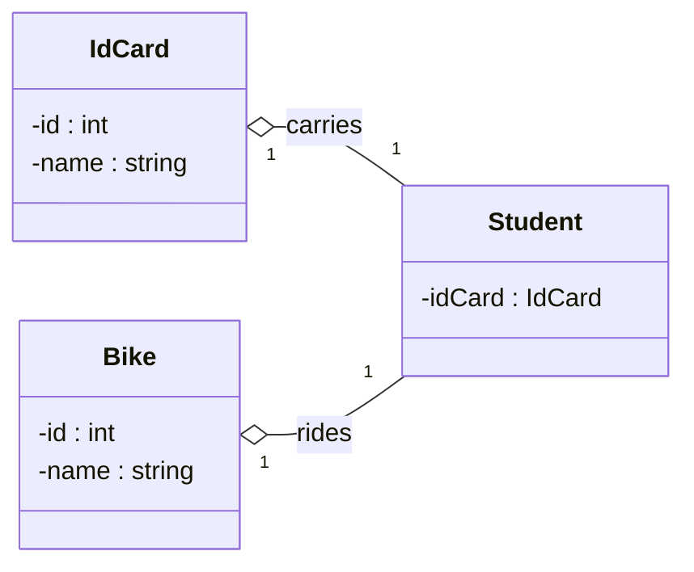
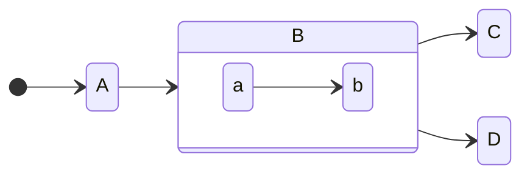
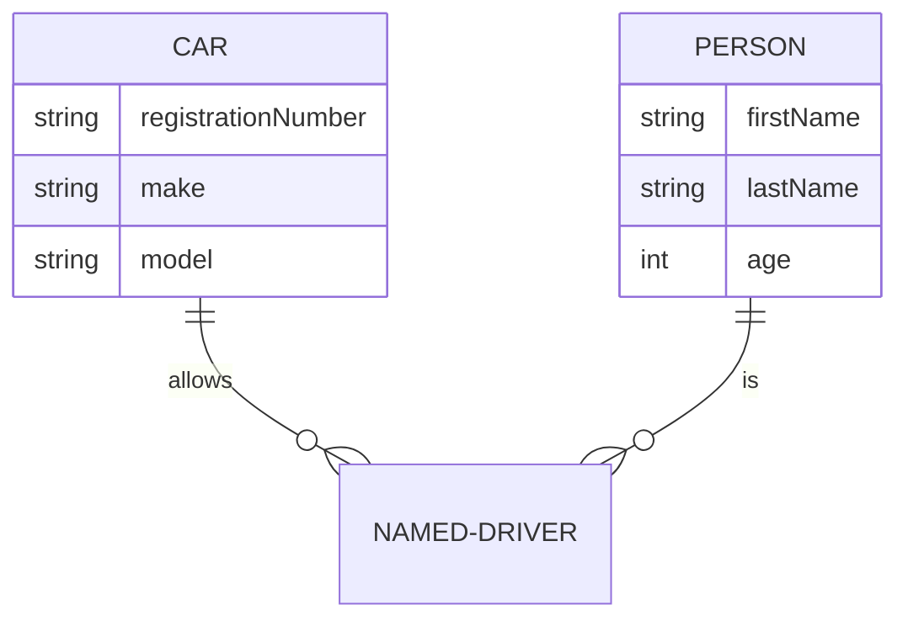
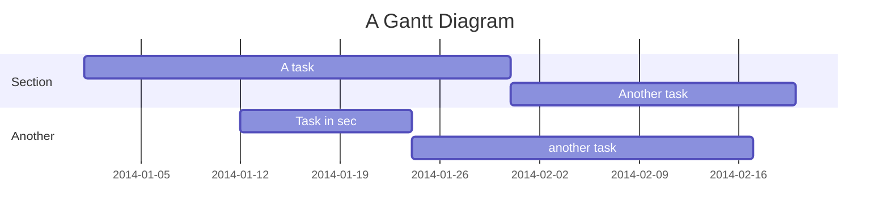
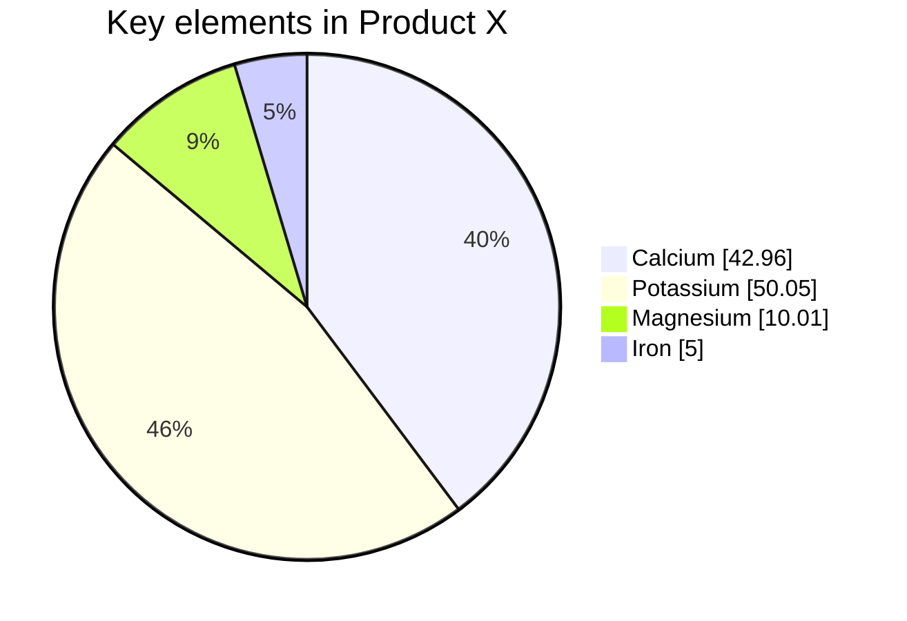
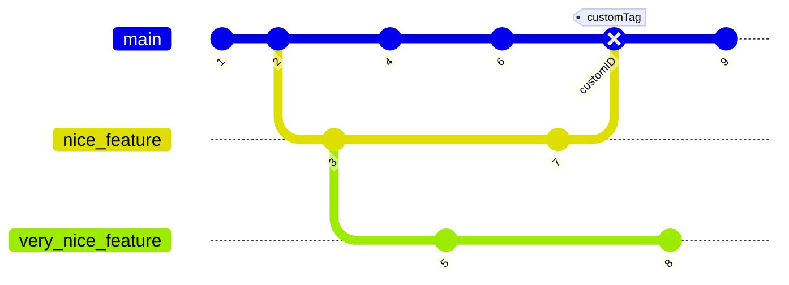

## MindMap

[MarkMap](https://markmap.js.org) is a Javascript library for rendering simple text definitions to MindMap in the browser.

For example, the following defines a simple MindMap:

```markmap
# markmap

## Links

- <https://markmap.js.org/>
- [GitHub](https://github.com/gera2ld/markmap)

## Related

- [coc-markmap](https://github.com/gera2ld/coc-markmap)
- [gatsby-remark-markmap](https://github.com/gera2ld/gatsby-remark-markmap)

## Features

- links
- **inline** ~~text~~ *styles*
- multiline
  text
- `inline code`
-
    ```js
    console.log('code block');
    ```
- Katex - $x = {-b \pm \sqrt{b^2-4ac} \over 2a}$
```

这是另一个中文的例子：

```markmap
# 置身事内

## 地方政府的权力与事务

## 财税与政府行为

## 政府投融资与债务

### 城投公司与土地金融

### 地方政府债务

### 招商引资重的地方官员

## 工业化中的政府角色

```

## Mermaid

### Flowchart



### Sequence Diagram



### Class Diagram


````tpl

````

<--->



### State Diagram



````tpl

````

<--->




### Entity Relationship Diagram



````tpl

````
<--->





### Gantt

````tpl

````


### Pie Chart



<!-- prettier-ignore -->
````tpl

````

<--->




### Gitgraph Diagram



### Mindmaps

Mermaid also support [mindmap](https://mermaid.js.org/syntax/mindmap.html) now, but we don't use it yet.

```js
<script type="module">
  import mermaid from 'https://cdn.jsdelivr.net/npm/mermaid@9/dist/mermaid.esm.min.mjs';
  import mindmap from 'https://cdn.jsdelivr.net/npm/@mermaid-js/mermaid-mindmap@9/dist/mermaid-mindmap.esm.min.mjs';
  await mermaid.registerExternalDiagrams([mindmap]);
</script>
```